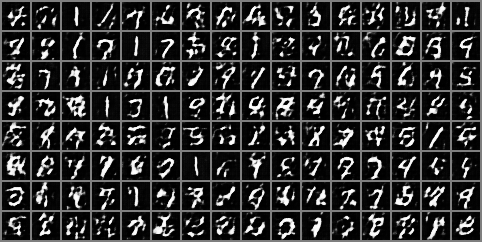

# MMD GAN: Understanding MMD and Implementing a Feature Extractor for Kernels

## To run  
- go to `MMD_DCGANS_feature_training_final.ipynb` and run the notebook boxes
- this was run on a V100 GPU with 32 Ram

please feel free to email me in case of Questions @ chems.benaziza[ at ] gmail.com

## Authors
- Chems Eddine Benaziza
- Mariia Baranova
- Sara Meziane

**Supervised by:** Arthur Leclaire

**Date:** June 21, 2024

## Abstract
This school project investigates the application of Maximum Mean Discrepancy (MMD) Generative Adversarial Networks (GANs) for image generation. We delve into the MMD loss formula, which measures the discrepancy between the distributions of real and generated images. Our goal is to compare MMD GANs with Wasserstein GAN (WGAN) to understand the trade-offs between various CNN feature extractors and the significance of gradient penalties.

## Introduction
Generative models generate new data samples that resemble a given dataset, unlike discriminative models that learn class boundaries. Generative Adversarial Networks (GANs) use two neural networks, a generator and a discriminator, in an adversarial setup to produce data that is indistinguishable from real data.

Traditional GANs use statistical divergences like KL divergence to measure distribution differences, but they lack sensitivity to nearby but non-overlapping classes. We explore Integral Probability Metrics (IPMs), specifically the Maximum Mean Discrepancy (MMD), which uses the largest discrepancy in expectation over a class of witness functions, offering an alternative to f-divergences.

## Theoretical Aspects
MMD is a metric for comparing probability distributions and belongs to the IPM family, similar to the Wasserstein metric used in WGAN. The MMD loss is defined as:
$$
\[ \text{MMD}(P, Q) = \sup_{f \in \mathcal{F}} \left( \mathbb{E}_{X \sim P}[f(X)] - \mathbb{E}_{Y \sim Q}[f(Y)] \right) \]
$$
Here, \( P \) and \( Q \) are probability distributions, and \( \mathcal{F} \) is a class of functions. The function that maximizes the difference in expectations belongs to a unit ball in a reproducing kernel Hilbert space (RKHS). MMD can also be expressed as the norm of the difference between mean embeddings of distributions \( P \) and \( Q \) in the RKHS \( \mathcal{H} \):

\[ \text{MMD}(P, Q) = \|\mu_P - \mu_Q\|_{\mathcal{H}} \]

## Implementation
We experimented with several architectures and MMD loss definitions, including fixed Gaussian kernels and adversarial training of feature extractors and generators.

### 2D Points Dataset with Fixed Kernel
We initially tested the MMD-GAN on a simple 2D dataset to understand its behavior. The generator was trained using the MMD witness function, and various kernels were explored.

### MNIST Dataset with Fixed Feature Extraction
Next, we applied a CNN feature extractor to the MNIST dataset, training the generator with fixed feature extraction. The MMD loss was computed using features extracted from both real and generated data.

### MNIST Dataset with Feature Extractor Training
We also experimented with a ConvNet as a feature extractor, training both the feature extractor and the generator. This approach improved the generation of clearer digits.

### MNIST Dataset with DCGAN Architecture
Finally, we replaced the MLP generator with a DCGAN architecture, which includes convolutional and convolutional-transpose layers. This yielded significant improvements after 30 or more epochs of training.

### Gradient Penalty and Feature Extractor Optimization
We explored the impact of adding a gradient penalty to our architecture and optimized both the feature extractor and generator to enhance performance further.

## Results
- **2D Points Dataset:** We observed that kernel parameters significantly influence MMD-GAN performance. The RBF kernel with \( \sigma = 0.05 \) provided the best results.
- **MNIST Dataset:** We achieved recognizable digits with fixed feature extraction and improved clarity with DCGAN and adversarial feature extraction. Adding a gradient penalty introduced some noise but helped smooth the witness function.

## Code and Implementation
You can find the entire project, including detailed notebooks and a README, on our [GitHub repository](https://github.com/chemousesi/mmd-gans-implementation).

**Hardware Used:** Tesla V100S-PCIE-32GB (Thanks to the INFRES department of Télécom Paris).

## Perspectives
While MMD GANs offer a promising alternative to traditional GANs, they are sensitive to kernel choice and network architecture. Future work will involve testing on more complex datasets and exploring different kernels and architectures.

## Conclusion
Our project demonstrated that MMD GANs, with careful parameter selection and architecture design, could generate data that closely matches real data. By leveraging adversarial training and gradient penalties, we achieved state-of-the-art performance in GAN training.

## References
1. Mikołaj Bińkowski, Dougal J. Sutherland, Michael Arbel, and Arthur Gretton. "Demystifying MMD GANs." International Conference on Learning Representations, 2018.
2. Ian J. Goodfellow. "NIPS 2016 tutorial: Generative adversarial networks." CoRR, abs/1701.00160, 2017.
3. Alec Radford, Luke Metz, and Soumith Chintala. "Unsupervised representation learning with deep convolutional generative adversarial networks," 2015.

---
*Note: This README is based on the report by Chems Eddine Benaziza, Mariia Baranova, and Sara Meziane, supervised by Arthur Leclaire (June 21, 2024).*
