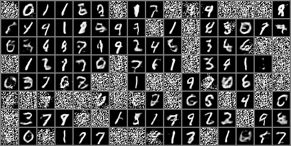

# mmd-gans-implementation

Note most important file is ; MMD-DCGANs.ipynb

## abstract 
This study investigates the application of Maximum Mean Discrepancy (MMD) Generative Adversarial Networks (GANs) for image generation. The research explores the formula of the MMD loss, which measures the discrepancy between the distributions of real and generated images. By comparing MMD GANs with the Wasserstein GAN (WGAN), the study aims to understand the trade-offs between different methods. The research also investigates the convergence of losses and the impact of different feature extractors on the performance of MMD GANs. The findings contribute to a deeper understanding of MMD GANs for image generation, providing insights for future research and applications

